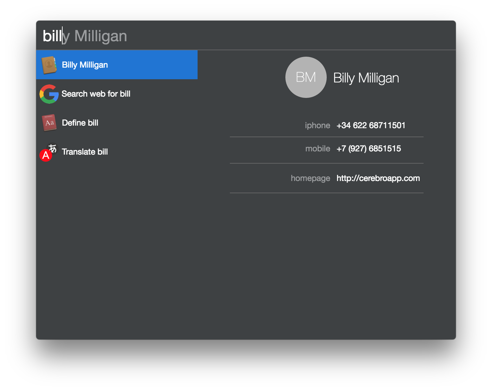

# cerebro-osx-contacts

> [Cerebro](https://cerebroapp.com) plugin to search in OSx Contacts.app

## Usage

Just type name or surname of your contact in Cerebro search field. You can navigate to preview by <kbd>→</kbd> and use <kbd>cmd+c</kbd> to copy selected field to clipboard.

## Related

* [Cerebro](http://github.com/KELiON/cerebro) – main repo for Cerebro app;
* [cerebro-plugin](https://github.com/KELiON/cerebro-plugin) – boilerplate to create plugins for Cerebro app.

## License

MIT © [Alexandr Subbotin](http://asubbotin.ru)
